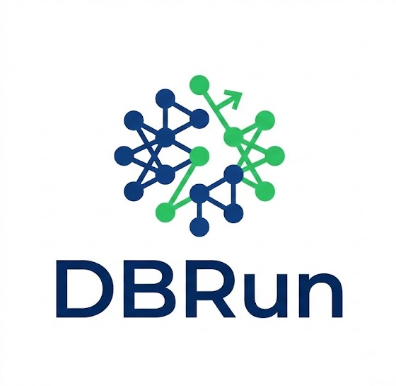

# DBRun

<p align="center">
  
</p>

<p align="center">
  <strong>现代化的数据库关系可视化工具</strong>
</p>

<p align="center">
  <strong>中文</strong> | <a href="README_EN.md">English</a>
</p>

<div align="center">
  
  <br>
  <em>轻松可视化您的数据库结构</em>
</div>

---

### 📖 项目简介

**DBRun** 是一款基于 **Go (Wails)** 和 **Vue 3** 开发的现代化桌面应用，旨在为开发者和 DBA 提供流畅的数据库结构可视化体验。它结合了 Go 语言的高性能后端能力与现代 Web 前端的灵活性。

无论您是在重构旧系统数据库，还是设计新的数据架构，DBRun 都能通过直观的画布帮助您理清表与表之间的复杂关系，轻松生成高质量的 ER 图。

### ✨ 功能特性

- **多数据库支持**：无缝连接 **MySQL**, **MariaDB**, **PostgreSQL**, **Oracle**, 和 **SQL Server**。
- **交互式可视化**：支持拖拽操作的无限画布，自由组织表结构视图。
- **智能关系映射**：自动识别并绘制表与表之间的外键关联关系。
- **可视化编辑**：自定义节点位置和布局，打造完美的数据库架构图。
- **本地优先**：所有数据库连接信息和元数据仅保存在本地，保障数据安全。
- **跨平台运行**：完美支持 **Windows**, **macOS** 和 **Linux** 系统。

### 🛠️ 技术栈

- **后端**：Go 1.21+, Wails v2, GORM, BoltDB
- **前端**：Vue 3, TypeScript, Vite, PrimeVue, Vue Flow, Tailwind CSS

### 🚀 快速开始

#### 环境要求
- Go 1.21 或更高版本
- Node.js & npm
- Wails CLI

#### 安装与运行

1. **安装 Wails CLI** (如果尚未安装)
   ```bash
   go install github.com/wailsapp/wails/v2/cmd/wails@latest
   ```

2. **克隆项目**
   ```bash
   git clone https://github.com/HeyChiang/DBRun.git
   cd DBRun
   ```

3. **安装依赖并启动开发环境**
   ```bash
   # 安装后端依赖
   go mod tidy
   
   # 启动开发模式（会自动安装前端依赖）
   wails dev
   ```

4. **构建应用**
   ```bash
   wails build
   ```

---

## 📄 License

This project is licensed under the MIT License.
