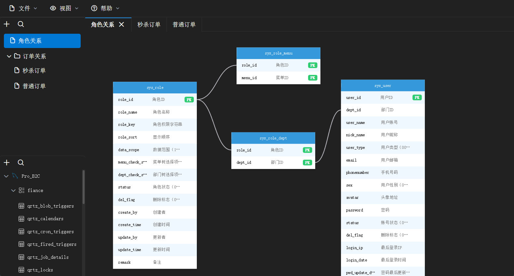

# DBRun

<p align="center">
  
</p>

<p align="center">
  <strong>A Modern Database Relationship Visualization Tool</strong>
</p>

<p align="center">
  <a href="README.md">中文</a> | <strong>English</strong>
</p>

<div align="center">
  
  <br>
  <em>Visualize your database schema with ease</em>
</div>

---

### 📖 Introduction

**DBRun** is a high-performance, cross-platform desktop application designed to help developers and database administrators visualize database schemas. Built with **Go (Wails)** and **Vue 3**, it combines the speed of a native backend with the flexibility of a modern web frontend.

Whether you are reverse-engineering a legacy database or designing a new schema, DBRun provides an intuitive canvas to explore table relationships, understand foreign key dependencies, and generate ER diagrams effortlessly.

### ✨ Key Features

- **Multi-Database Support**: Connect seamlessly to **MySQL**, **MariaDB**, **PostgreSQL**, **Oracle**, and **SQL Server**.
- **Interactive Visualization**: Drag and drop tables onto an infinite canvas.
- **Smart Relationship Mapping**: Automatically detects and draws relationships (foreign keys) between tables.
- **Visual Editing**: Customize node positions and layout to create the perfect ER diagram.
- **Local-First**: Your database credentials and schema metadata are stored locally on your machine for maximum security.
- **Cross-Platform**: Runs smoothly on **Windows**, **macOS**, and **Linux**.

### 🛠️ Tech Stack

- **Backend**: Go 1.21+, Wails v2, GORM, BoltDB
- **Frontend**: Vue 3, TypeScript, Vite, PrimeVue, Vue Flow, Tailwind CSS

### 🚀 Getting Started

#### Prerequisites
- Go 1.21 or higher
- Node.js & npm
- Wails CLI

#### Installation

1. **Install Wails CLI** (if not already installed)
   ```bash
   go install github.com/wailsapp/wails/v2/cmd/wails@latest
   ```

2. **Clone the repository**
   ```bash
   git clone https://github.com/HeyChiang/DBRun.git
   cd DBRun
   ```

3. **Install Dependencies & Run**
   ```bash
   # Install backend dependencies
   go mod tidy

   # Run in development mode (frontend dependencies will be installed automatically)
   wails dev
   ```

4. **Build for Production**
   ```bash
   wails build
   ```

---

## 📄 License

This project is licensed under the MIT License.
